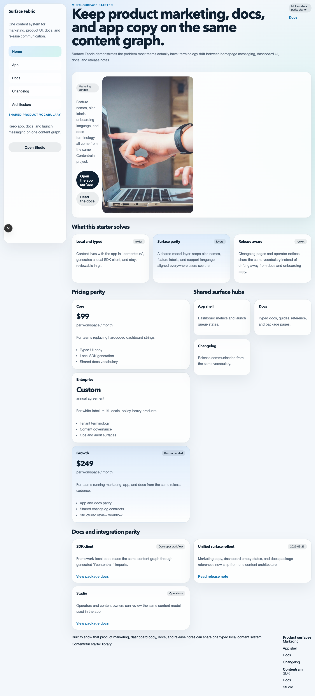
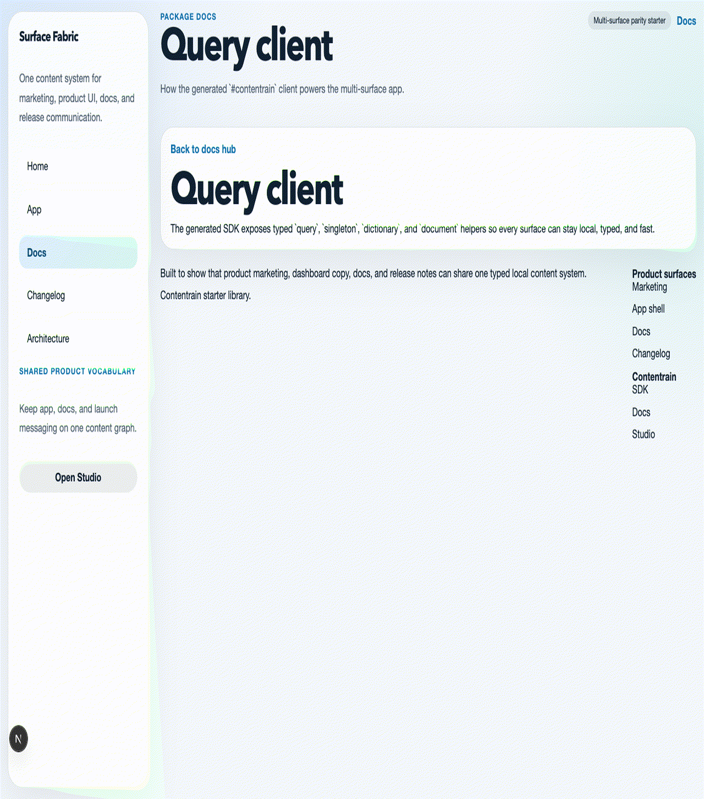

> Source of truth: this starter is exported from the `contentrain-starters` monorepo.
> Internal starter id: `next-multi-surface-saas`.
# Contentrain Next Multi-Surface SaaS

Next.js starter for teams that need one content architecture across marketing, app shell, docs, and changelog surfaces.





## Start

```bash
pnpm install
pnpm dev
```

## Commands

```bash
pnpm check
pnpm build
pnpm start
pnpm deploy:netlify
```

## Demo routes

- `/`
- `/app`
- `/docs`
- `/guides/surface-governance`
- `/reference/content-contracts`
- `/packages/query-client`
- `/changelog/unified-surface-rollout`
- `/architecture`

## Why this starter exists

- Product marketing, dashboard UI, docs, and release notes should not drift apart
- `.contentrain/` stays local, typed, and reviewable in git
- The generated `#contentrain` SDK keeps framework code simple while preserving a real content schema
- This starter shows Contentrain as product-surface infrastructure, not only as a website CMS

Official references:

- [SDK](https://ai.contentrain.io/packages/sdk.html)
- [Docs](https://docs.contentrain.io/)
- [Studio](https://studio.contentrain.io/)

## Deploy

- Netlify build command: `pnpm deploy:netlify`
- Netlify publish directory: framework-managed
- Keep the publish directory empty in the Netlify UI and let the Next.js runtime be detected automatically

## Netlify Project Creation

[](https://app.netlify.com/start/deploy?repository=https%3A%2F%2Fgithub.com%2FContentrain%2Fcontentrain-starter-next-multi-surface-saas)

Use `pnpm dlx netlify-cli init` to connect the repository for continuous deployment, or `pnpm dlx netlify-cli link` if the site already exists.
